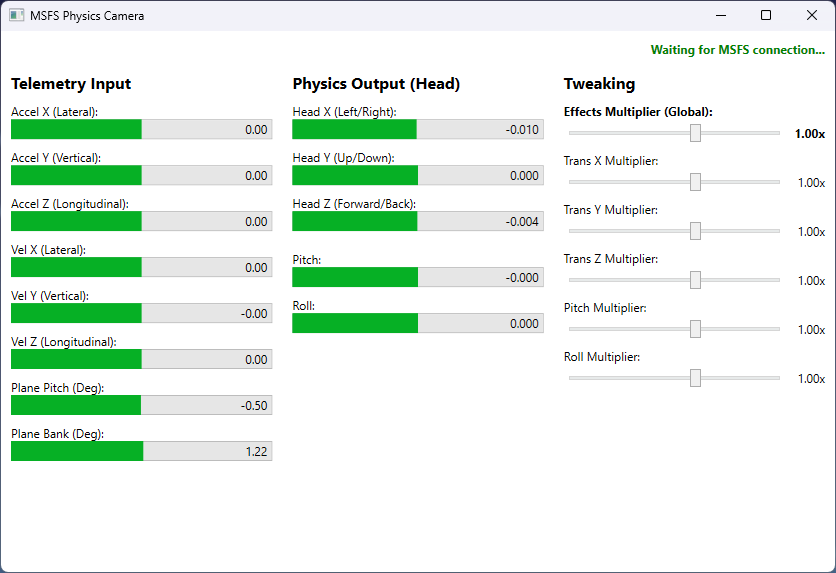
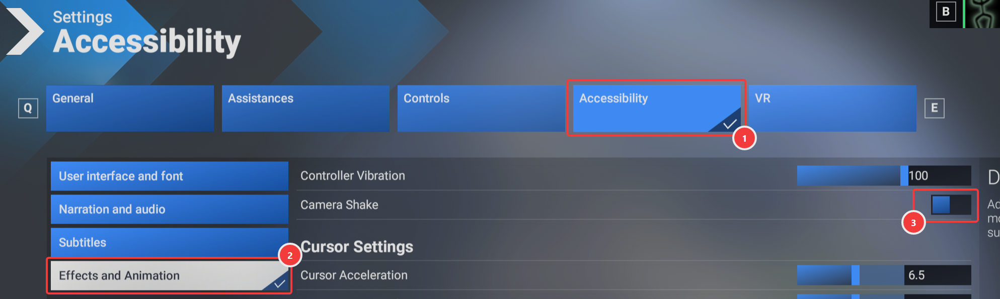

# MSFS Physics Camera


A standalone application for Microsoft Flight Simulator 2020/2024 that adds realistic, physics-based head movements (head shake, G-force effects) to the virtual cockpit. It reads aircraft telemetry via SimConnect and injects camera movements using the FreeTrack protocol.

## Features

- **Physics-Based Movement**: Uses a spring-mass-damper physics engine to simulate realistic head movements based on aircraft acceleration and velocity.
- **Customizable Effects**: Adjust the intensity of lateral, vertical, longitudinal, pitch, and roll movements in real-time via the UI.
- **Seamless Integration**: Connects to MSFS via SimConnect and injects data via FreeTrack.
- **Auto-Start**: Includes scripts to automatically start and stop with MSFS.

## Showcase



https://github.com/user-attachments/assets/754c5b30-4dcb-49b1-9095-6a5220380bea

https://github.com/user-attachments/assets/f35fa594-357c-4c8a-a619-67fbac6674d8

https://github.com/user-attachments/assets/abc0d6e2-2e89-48db-8f8d-b41ec855b2ba

## Compatibility

Verified to work on:
- Microsoft Flight Simulator 2020
- Microsoft Flight Simulator 2024

## Installation

1. Download the latest release.
2. Extract the files to your MSFS Community folder (or any other folder of your choice).
3. Run `AutoStart-Install.bat` to register the application to start automatically when MSFS launches.
   - *To uninstall the auto-start behavior, run `AutoStart-Uninstall.bat`.*
4. Alternatively, you can run `MsfsPhysicsCamera.exe` manually before or during your flight.
5. You'll likely want to disable the built-in camera shake 

*Note: TrackIR/FreeTrack is automatically enabled on first run if found to be unconfigured using the included `NPClient64.dll`.*

## Development

### Prerequisites

- [.NET 10.0 SDK](https://dotnet.microsoft.com/download/dotnet/10.0)
- Microsoft Flight Simulator 2024 SDK (required for `SimConnect.dll`)

### Setup

```bash
# Clone the repository
git clone https://github.com/martijns/martijns-msfs2024-physics-camera.git
cd martijns-msfs2024-physics-camera

# Build the project
dotnet build
```

*Note: The project expects `SimConnect.dll` to be located at `c:\MSFS 2024 SDK\SimConnect SDK\lib\SimConnect.dll`.*

### Debugging

You can run and debug the application directly from Visual Studio or VS Code. The application will attempt to connect to SimConnect and the FreeTrack shared memory automatically.

## License

MIT License - see LICENSE file for details.
